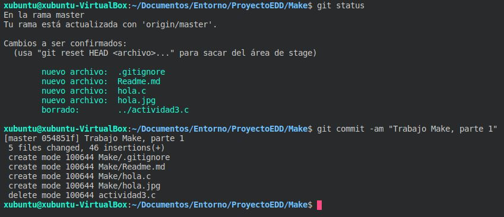
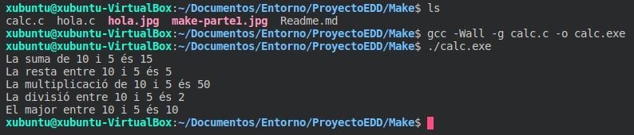
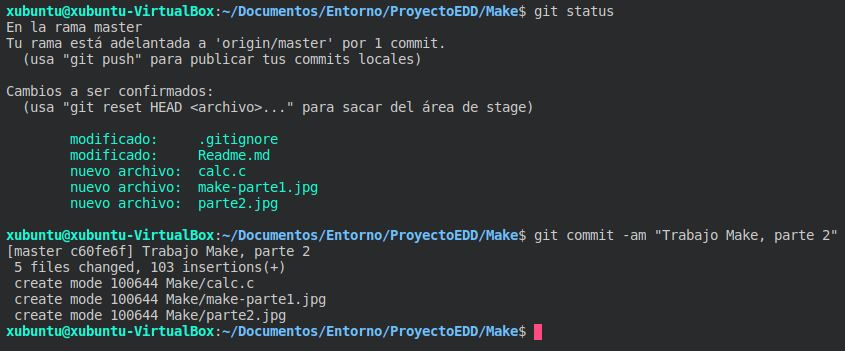

# Trabajos de automatización

Trabajo de clase de EDD sobre la automatización con make

> Este trabajo se divide en tres partes:
> 1. Realizar un programa en `C` que muestre "`hola mundo`" y compilarlo con `gcc` y probar como se hace con `make`.
> 2. Realizar un programa en `C` que `sume, reste, multiplique, divida y diga cual de los dos números es mayor` en el que se usarán funciones en el mismo archivo y habría que compilarlo para comprobar que funcione.
> 3. Realizar el mismo programa que en el apartado pero separándolo en tres archivos, uno con las funciones, otro con las cabeceras de las funciones y el otro el programa principal. También habría que añadir un archivo `Makefile` con los objetivos `calcula, calc.o, clean, dist, targz e install`.

## Primera parte

Contenido del archivo `hola.c`

```C
#include <stdio.h>

int main(){
    printf("Hola mundo\n");
    return 0;
}
```

Orden para compilar el archivo `hola.c`.

```bash
    gcc -Wall -g hola.c -o hola.exe
```
Compilación con `make` sin tener un archivo `Makefile`. Asume por defecto que quieres compilar el archivo

```
    make hola
```

Captura de comprobación:


#### Captura commit parte1



## Segunda parte

Contenido del archivo `calc.c`

> Contiene las funciones suma, resta, multiplica, divideix, major y main

```C
#include <stdio.h>

int suma(int op1, int op2){
    return (op1+op2);
}

int resta(int op1, int op2){
    return (op1-op2);
}

int multiplica(int op1, int op2){
    return (op1*op2);
}

int divideix(int op1, int op2){
    return (op1/op2);
}

int major(int op1, int op2){
    if (op1>op2)
    {
        return op1;
    }else
    {
        return op2;
    }
}//major

int main(){
    int a=10;
    int b=5;
    printf("La suma de %d i %d és %d\n", a, b, suma(a,b));
    printf("La resta entre %d i %d és %d\n", a, b, resta(a,b));
    printf("La multiplicació de %d i %d és %d\n", a, b, multiplica(a,b));
    printf("La divisió entre %d i %d és %d\n", a, b, divideix(a,b));
    printf("El major entre %d i %d és %d\n", a, b, major(a,b));
}
```
Orden para compilar el archivo `calc.c`.

```bash
    gcc -Wall -g calc.c -o calc.exe
```
Captura de comprobación:



#### Captura commit parte2


