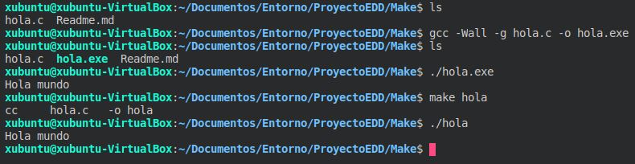

# Trabajos de automatización

Trabajo de clase de EDD sobre la automatización con make

> Este trabajo se divide en tres partes:
> 1. Realizar un programa en `C` que muestre "`hola mundo`" y compilarlo con `gcc` y probar como se hace con `make`.
> 2. Realizar un programa en `C` que `sume, reste, multiplique, divida y diga cual de los dos números es mayor` en el que se usarán funciones en el mismo archivo y habría que compilarlo para comprobar que funcione.
> 3. Realizar el mismo programa que en el apartado pero separándolo en tres archivos, uno con las funciones, otro con las cabeceras de las funciones y el otro el programa principal. También habría que añadir un archivo `Makefile` con los objetivos `calcula, calc.o, clean, dist, targz e install`.

## Primera parte

Contenido del archivo `hola.c`

```C
#include <stdio.h>

int main(){
    printf("Hola mundo\n");
    return 0;
}
```

Orden para compilar el archivo `hola.c`.

```bash
    gcc -Wall -g hola.c -o hola.exe
```
Compilación con `make` sin tener un archivo `Makefile`. Asume por defecto que quieres compilar el archivo

```
    make hola
```

Captura de comprobación:



